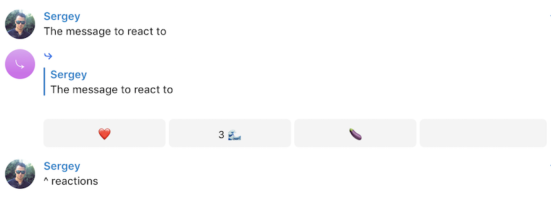

# telegram-emoji-reactions-bot

Emoji reactions bot for Telegram. Public instance: [@emoji_reactions_bot](https://t.me/emoji_reactions_bot)



Includes reaction notifications:


## Contents

- [Set-up](#set-up)
- [Get it](#get-it)
- [Usage](#usage)

## Set-up

1. Add the bot [@emoji_reactions_bot](https://t.me/emoji_reactions_bot) (or your own instance) to a group
2. Give it admin (`Delete messages`) rights
3. See [Usage](#usage)

## Get it

Using go get:

```bash
go get -u github.com/sgreben/telegram-emoji-reactions-bot
```

Or [download the binary for your platform](https://github.com/sgreben/telegram-emoji-reactions-bot/releases/latest) from the releases page.

## Usage

### Telegram

1. Reply to a message with only emoji (or a single letter)
2. Add further emoji by either...
   - ...using the buttons to `+1` existing emoji, or
   - ...replying with new emoji

### CLI

```text
telegram-emoji-reactions-bot -token BOT_TOKEN

Usage of telegram-emoji-reactions-bot:
  -button-row-length int
    	 (default 5)
  -button-row-min-length int
    	 (default 2)
  -timeout duration
    	 (default 2s)
  -token string
    	
  -v	(alas for -verbose)
  -verbose
    	
```
